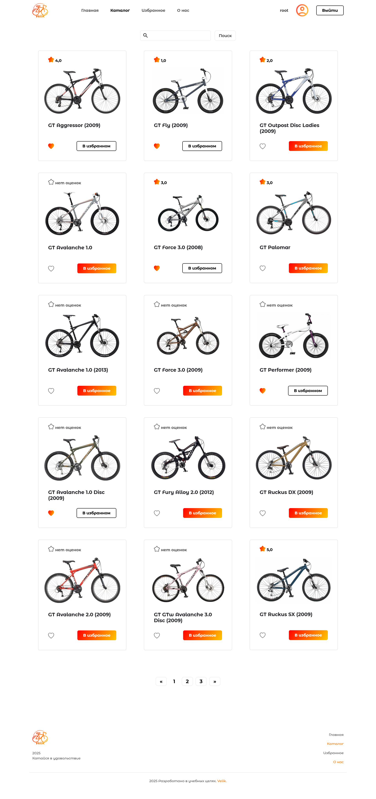

# Сайт Velik

- Написан на языке Python
- Используется фреймворк Django
- База данных — MySQL

## Velik — веб-каталог велосипедов

- Можно просмотреть характеристики каждого велосипеда
- Есть возможность входа, регистрации, а также редактирования профиля
- Пользователь может добалять в избранное, а также выставлять оценки
- Также выводятся рекомендации на странице конкретного велосипеда (используется API для получения рекомендаций)

## Главная
 

## Каталог
 

## Страница велосипеда
.png) 

## О себе
 

## Профиль пользователя
 

## Мои оценки
 

## Форма входа
 

## Форма регистрации
 